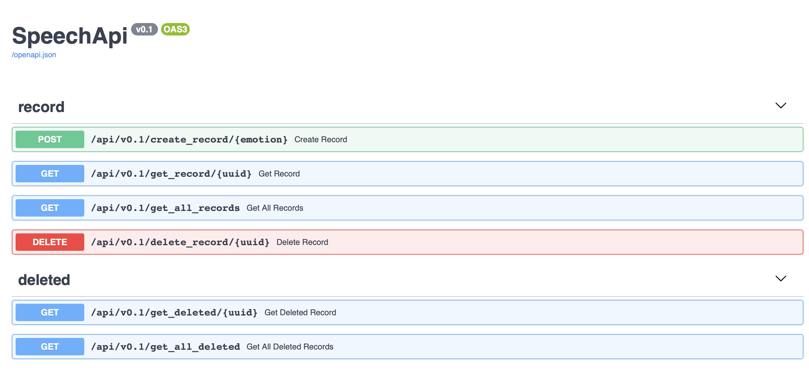

# SpeechWebApp Api v0.1

## Install requirements
```
pip install -r requirements.txt
```

## Run Api
Default port is 8081
```
python -m src.app
```

## Run tests
```
pytest
```

## Swagger documentation
* Accessible at : http://0.0.0.0:8081/docs
* Swagger allows users to try endpoints from the doc

<p align="center">
  
</p>


