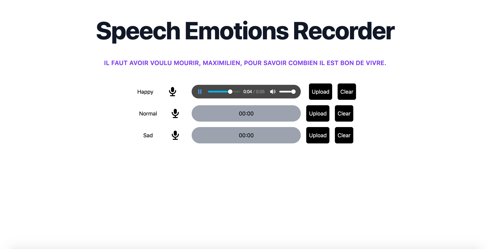

# Speech Emotion Webapp Frontend

This folder contains all the necessary files to build to Speech Emotion Webapp Fontend.

## Building

This project uses Tailwind as a CSS framework and React for the voice recording component.

```bash
npm install        # install dependencies
npm run build-css  # build the CSS using Tailwind
npm run build-js   # build the JS using webpack
npm run build      # build both the CSS and JS
npm run server     # start the dev server on localhost:3000 & watch JS changes
npm run watch      # runs server and watch on css / tailwind config files 
```

## Screenshot



## Docker

Build:

```sh
docker build -t speech-emotion-webapp/frontend -f docker/web-app/Dockerfile .
```

Run:

```sh
docker run -p 3000:3000 speech-emotion-webapp/frontend
```